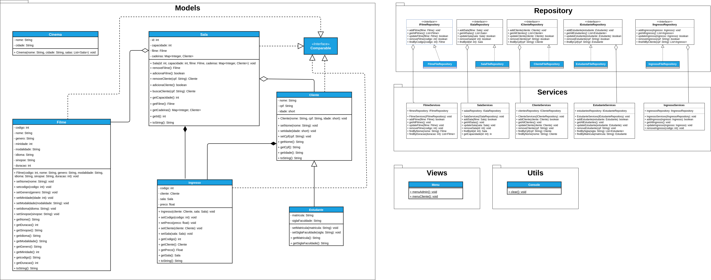
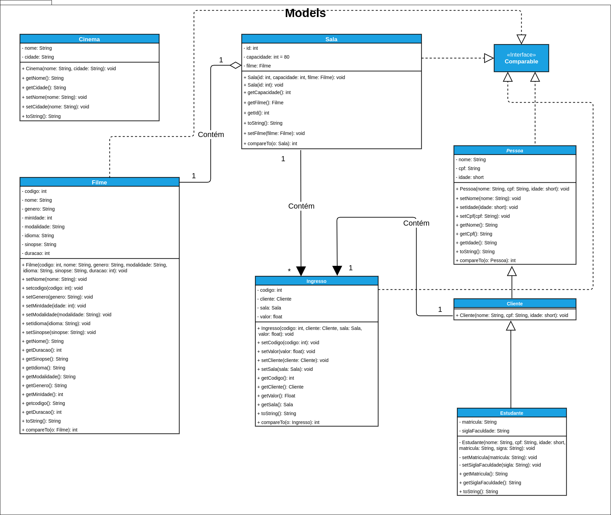
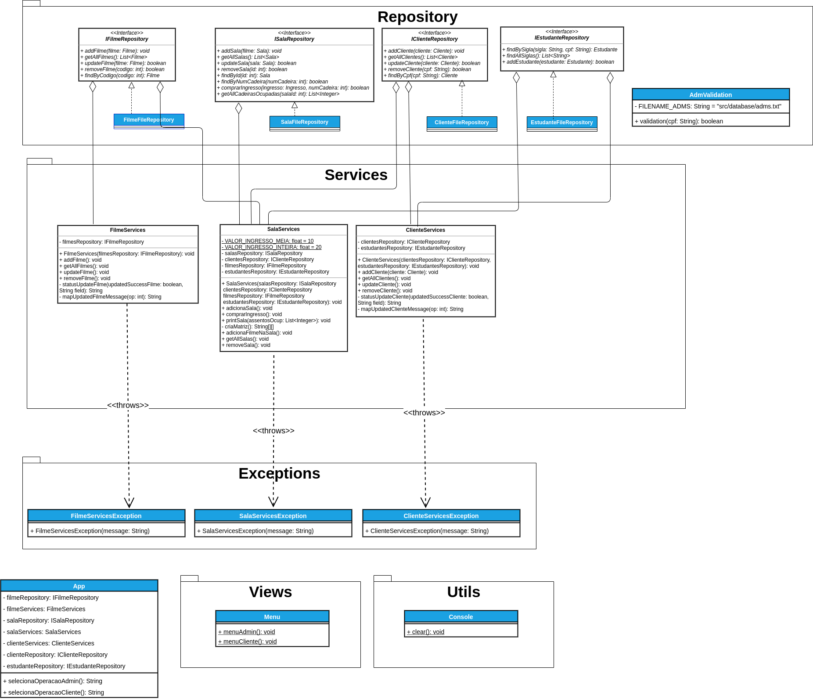

# Projeto Final - POO: Sistema de gerenciamento de um cinema
Alunos: Anderson Silva e Samuel Henrique

Curso: Engenharia de Computação - 2021.2

Professor: Atílio Gomes Luiz

## 1. Objetivo
  Este documento contém os requisitos necessário para o desenvolvimento de um sistema de gerenciamento de ingresso para um cinema. Estes requisitos vão descrever uma versão inicial de um sistema para um cinema, ou seja, um mínimo produto viável – em inglês, *Minimum Viable Product* (MVP). Sendo assim, à aplicação consiste em que o cliente vai poder escolher uma determinada sala para assistir algum filme que deseje.
  
## 2. Requisitos do Sistema

### 2.1 Entidade Cinema
    
* O cinema pode ter uma ou mais salas.
* O cinema deve ter um nome.
* Deve ser possível obter a cidade do cinema.
* O cinema tem um cliente do tipo administrador e outro tipo que representa um cliente comum.

### 2.2 Entidade Sala

* Um sala só pode exibir um filme por vez.
* Uma sala deve possuir uma quantidade máxima de cadeiras.
* Só poderá entrar na sala se o cliente tiver idade suficiente para a classificação indicativa do filme.
* Deve ser possível remover uma sala.
* Deve ser possível atualizar qualquer informação de uma sala cadastrado.
* Deve ser possível fazer uma buscar pelo id da sala.
* Deve ser possível obter a capacidade da sala
* Deve ser possível listar todas as sala cadastradas

### 2.3 Entidade Cliente

* O cliente só pode estar em uma sala de cada vez.
* Deve ser possível remover um cliente.
* Dever ser possível realizar o cadastro de clientes nas salas (nome, idade, CPF).
* Deve ser possível atualizar qualquer informação de um cliente cadastrado.
* Deve ser possível buscar um cliente pelo CPF
* Deve ser possível buscar um cliente pela matrícula, caso seja um estudante.
* Deve ser possível buscar um cliente pela sigla da faculdade, caso seja estudante.

### 2.4 Entidade Filme

* O ingresso tem dois preços: meia e inteira.
* Deve ser possível realizar cadastro de filmes (nome, código, duração, sinopse, gênero, idioma e modalidade (3D ou 2D)).
* Deve ser possível remover um filme.
* Deve ser possível atualizar qualquer informação de um filme cadastrado.
* Deve ser possível buscar um filme pelo nome
* Deve ser possível listar todos os filmes
* Deve ser possível obter todos os filmes com uma determinada duração (em minutos).

### 2.5 Considerações finais
    É importante destacar que podem haver mudanças no decorrer do desenvolvimento do sistema.

## Diagrama de Classes - UML
* Diagrama completo de todos os pacotes

* Diagrama do pacote Models

* Diagrama pacotes Repository, Services, Views e Utils 
